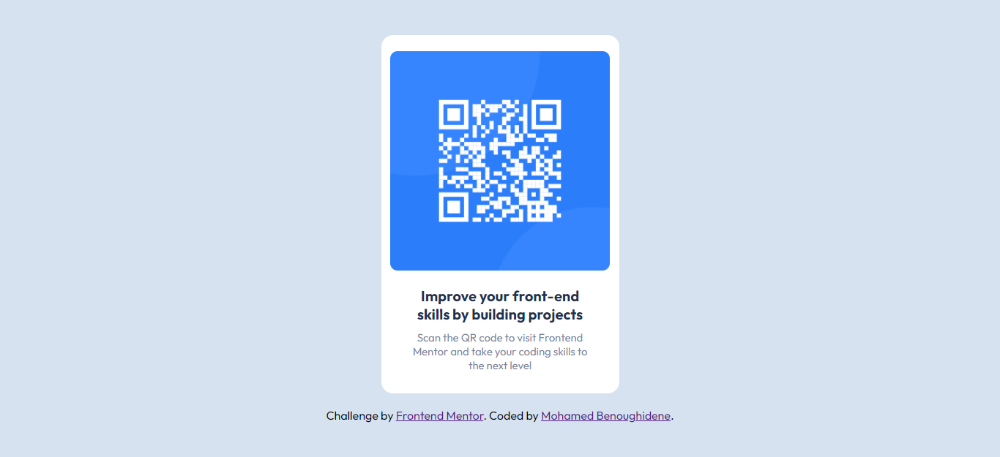

# Frontend Mentor - QR code component solution

This is a solution to the [QR code component challenge on Frontend Mentor](https://www.frontendmentor.io/challenges/qr-code-component-iux_sIO_H).

## Table of contents

- [Overview](#overview)
  - [Screenshot](#screenshot)
  - [Links](#links)
  - [Built with](#built-with)
- [Author](#author)

## Overview

this is a simple QR code Component

### Screenshot

### Links

- Solution URL: [Add solution URL here](https://github.com/mohamed-benoughidene/QR-code-component)
- Live Site URL: [Add live site URL here](https://heartfelt-clafoutis-4e7647.netlify.app)

### Built with

- [React](https://reactjs.org/) - JS library
- CSS
- Sass
- Flexbox

## Author

- Frontend Mentor - [@mohamed-benoughidene](https://www.frontendmentor.io/profile/mohamed-benoughidene)
